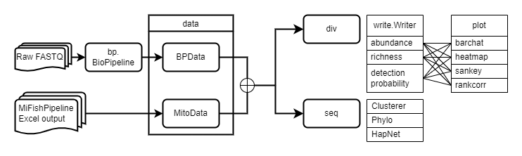
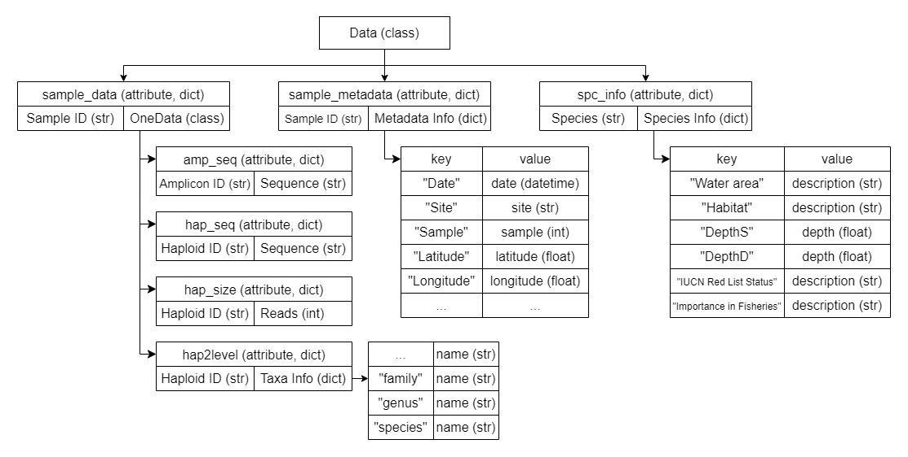

# eDNA Bioinformatics Pipeline (ednabp)

A comprehensive Python package for processing environmental DNA (eDNA) sequences through bioinformatics workflows including quality control, taxonomic assignment, and diversity analysis.

## Contents

- [Installation](#installation)
- [Modules](#modules)
- [Usage Examples](#usage-examples)
- [Testing](#testing)

## Installation


### Package Installation

1. Install dependencies:
```bash
pip install -r requirements.txt
```

2. Install from source:
```bash
git clone https://github.com/ComputationalAgronomy/ednabp.git
cd ednabp
pip install -e .
```

### Additional prerequisites for running the `bp` module

If you will run the `bp` module, ensure the following external tools are installed and available in your PATH:
* **Cutadapt** - [Download](https://cutadapt.readthedocs.io/en/stable/installation.html)
* **USEARCH** - [Download](https://github.com/rcedgar/usearch12.git)
* **NCBI-BLAST+** - [Download](https://ftp.ncbi.nlm.nih.gov/blast/executables/blast+/LATEST/)

### Additional prerequisites for running the `seq` module

If you will run the `seq` module, ensure the following external tools are installed and available in your PATH:
* **USEARCH** - [Download](https://github.com/rcedgar/usearch12.git)
* **Clustal Omega** - [Download](http://www.clustal.org/omega/)
* **IQTREE** - [Download](https://iqtree.github.io/doc/Quickstart#installation)

## Modules



### 1. Bioinformatics Pipeline (`bp`)
Core processing pipeline with the following stages:

- **Decompress**: Extract compressed FASTQ files
- **Merge**: Combine paired-end reads
- **Cut Primer**: Remove primer sequences and length filtering
- **FASTQ to FASTA**: Format conversion
- **Dereplicate**: Remove duplicate sequences
- **Denoise**: Error correction
- **Assign Taxa**: Taxonomic classification

### 2. Data Management (`data`)

- **Data Objects**: Structured data containers for pipeline results.

A complete data container structure looks like the following:



### 3. Diversity Analysis (`div`)

- **Writing**: Export diversity metrics CSV tables.
- **Plotting**: Visualization tools (`barchart`, `heatmap`, `rankcorr`, `sankey`) using Plotly as the underlying package.

### 4. Sequence Analysis (`seq`)

- **Clustering**: Sequence clustering analysis architecture that accepts a reducer class (e.g., `PCA`, `TSNE`, `UMAP`) and a clusterer class (e.g., `AgglomerativeClustering`, `HDBSCAN`). Note: You may need to install additional packages to access these classes.
- **Phylogenetics**: Tree construction and analysis using **IQTREE**.        .
- (TODO) **Haplotype Networks**: Write NEXUS files as input for **POPART** to draw haplotype networks.

May separate the `cluster` module into an independent repository in the future to keep each repo simple.

May remove the `phylo` and `hap_net modules` as it is somewhat redundant to use a Python interface rather than using those software packages directly.

## Usage Examples
- [Pipeline processing](#pipeline-processing)
- [Data management](#data-management)
- [Diversity metrics summary](#diversity-metrics-summary)

### Pipeline Processing
```python
from ednabp.bp import BioPipeline
```

#### Run default pipeline
```python
pipeline = BioPipeline(
    input_path="/path/to/files_folder",   # Directory containing multiple files
    # input_path="/path/to/single_file",  # Alternative: single file input
    output_path="/path/to/output",
)
```

#### Run custom settings
```python
custom_settings = {
    "rm_p_5": "GGACGATAAGACCCTATAAA",
    "rm_p_3": "ACTTTAGGGATAACAGCGT",
    "min_read_len": 154,
    "max_read_len": 189,
    "verbose": True,
    "n_cpu": 8,
}

pipeline = BioPipeline(
    input_path="/path/to/files_folder",
    output_path="/path/to/output",
    **custom_settings
)
```
#### CLI

```bash
ednabp -i INPUT_PATH -o OUTPUT_PATH
```

To check the parameters, please run command:
```bash
ednabp -h
```

### Data Management
```python
from ednabp.data import BPData, MitoData
```

#### Import from ednabp.bp.BioPipeline outputs
```python
data = BPData()
data.import_data("results/")
# optional
data.import_metadata("path/to/sample_metadata")
data.import_spc_info("path/to/fishbase_db", "path/to/stock_db")
```

#### Import from MiFish Pipeline outputs

This package supports import data from another popular pipeline to run downstream analysis.

[MiFish Pipeline webpage](https://mitofish.aori.u-tokyo.ac.jp/mifish/)

```python
data = MitoData()
data.import_data("results/")
# optional
data.import_metadata("path/to/sample_metadata")
```

#### Reuse a data container
You can serialize and deserialize a data container for repetitive use. This process is known as "pickling" and "unpickling." Note: Never unpickle a .pkl file from an unknown source.

```python
data.pickle_data("path/to/save_dir", "save_name")
```
Next time, you only need to unpickle the data container and don't need to import everything again.

```python
data = BPData()
data.unpickle_data("path/to/pkl_file")
```

### Diversity Metrics Summary
Here is an example with writing abundance table and drawing barchart of species abundance across samples.


```python
from ednabp.div.write import Writer
from ednabp.div.plot import barchart

# Create abundance dataframe
writer = Writer(data)
df = writer.abundance(taxa_lv='species')

# Generate barchart
fig, plotter = barchart(
    df=df,
    values='abundance',
    index='species',
    columns='sample_id'
)
```

We also provide two other metrics: **richness** and **detection probability**, plus three additional visualization options: **heatmap**, **sankey diagram**, and **rank correlation matrix**. Additionally, you can customize parameters for summarizing metrics and visualizing data, such as `taxa_lv`, `values`, `index`, and `columns`. These options give you the flexibility to describe your own data.

## Testing

Run the test suite:

```bash
pytest
# or
pytest ./tests/test_XXX.py
```